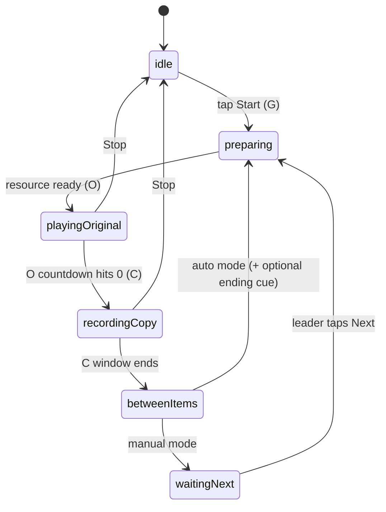
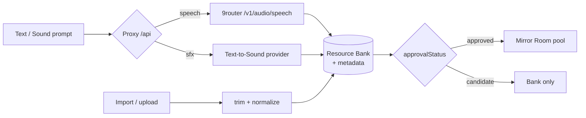

# 02 — Architecture · Chunks Mirror (Sound)

**Architecture status: Candidate — pending human confirmation at the build-plan gate.**
Direction "A, go" confirmed 2026-06-16 (adopt + refresh existing `chunks-mirror` context here). Stack follows Lucy's existing **Chunks App Pattern**; no new framework introduced.

## Detected reality

- No app code exists yet in this repo (greenfield). Sibling `../chunks-mirror` holds docs only.
- Lucy's prior Chunks apps use React/Vite + Firebase Hosting + same-origin `/api/*` proxy.

## Candidate stack

| Layer | Choice | Why |
|---|---|---|
| UI | React + Vite + TypeScript | Lucy's established pattern; fast HMR; typed domain |
| Styling | Tailwind CSS | Maps to design-taste rules; fast Swiss-minimal system |
| Audio out | Web Audio API / `<audio>` | Precise timing for O + countdown |
| Audio in | MediaRecorder API | Capture Copy Signal during C |
| State | local `useState`/`useReducer`; small store for Room | One-button loop is local; no heavy global state |
| Data | local JSON seed manifest + `public/resources/audio`, plus Firebase Functions → Cloud Storage for generated audio | Local seed remains, cross-device cloud persistence enabled |
| Providers | **9router** TTS + Text-to-Sound, via `/api/*` proxy | Multi-provider, multilingual, key stays server-side |
| Hosting | Firebase Hosting site `chunks-mirror` → `https://chunks-mirror.web.app` (preview-first) | Lucy's deploy target; Functions host `/api/*` in prod |

Alternatives considered and rejected for v1: Next.js (heavier than the one-button loop needs); direct browser→provider calls (leaks `NINEROUTER_KEY`, CORS/mixed-content); cloud DB from day one (premature before the loop is proven).

## Module boundaries

```text
src/domain/        pure, IO-free
  types.ts             ChunksAwareResource, RoomSettings, LoopPhase, MirrorAttempt
  mirrorLoop.ts        MirrorLoopController state machine
  approval.ts          approval-status policy (only approved play)
  selection.ts         filter + random-mix pool selection

src/adapters/      side effects behind interfaces
  storage.ts           StorageAdapter (interface)
  localJsonStorage.ts  LocalJsonStorageAdapter
  audioPlayback.ts     BrowserAudioPlaybackAdapter
  micCapture.ts        BrowserMicRecordingAdapter
  tts.ts               TTSAdapter -> /api/tts (9router)
  textToSound.ts       TextToSoundAdapter -> /api/sound

src/features/
  mirror/              Learner Loop Surface (one button + countdown)
  resources/           Resource Bank Surface (generate/import/approve/filter)
  settings/            Dynamic Settings

src/ui/                tokens + primitives (Button, Tabs, Pill, Countdown)

functions/             Firebase Functions same-origin API (`/api/*`: 9router proxy + Cloud Storage audio handlers)
  tts.ts               POST -> $NINEROUTER_URL/v1/audio/speech
  sound.ts             POST -> text-to-sound provider
```

## Mirror Loop state machine



Scoring state (`scoring → result`) is **designed-in but disabled** in v1: the controller emits a `MirrorAttempt` (source + copy blobs) that a future `AcousticScoringPort` will consume.

## Sound generation pipeline (never inside the loop)



## Provider contract — 9router

- `POST $NINEROUTER_URL/v1/audio/speech` · body `{ model, input }` · `Authorization: Bearer $NINEROUTER_KEY`.
- `model` = voice id: `edge-tts/<locale-voice>` (free), `el/eleven_multilingual_v2` (premium), `openai/...`, `google/<lang>`.
- `response_format=mp3` (bytes) or `json` (`{audio: base64, format}`).
- Discovery: `GET /v1/models/tts`, `GET /v1/audio/voices?provider=edge-tts&lang=<code>`.
- **All calls server-side** through Firebase Functions `/api/tts`. Browser never sees the key.

## Security & secrets

`.env.local` (gitignored): `NINEROUTER_URL`, `NINEROUTER_KEY`. Browser calls `/api/*` only. Firebase Functions hold the key in Secret Manager (`NINEROUTER_KEY`) and use the project audio bucket `chunks-mirror-audio-284566312743`.

## Data shape

Single source shape: `ChunksAwareResource` (see `CONTEXT.md` schema). Seed manifest `src/data/resources.json`; seed audio under `public/resources/audio/{category}/`. Generated/imported cloud audio is stored by Firebase Functions under `gs://chunks-mirror-audio-284566312743/audio/` with `.meta.json` sidecars.

## Open / R&D

- **Music Snippet generation** — no committed provider; import-first. → R&D task.
- **Acoustic scoring v0** — algorithm (duration + energy envelope + spectral) deferred to v2. → R&D task.
- **Firebase Storage native bucket** — optional later migration from the project Cloud Storage bucket if Firebase managed Storage is enabled in console.
